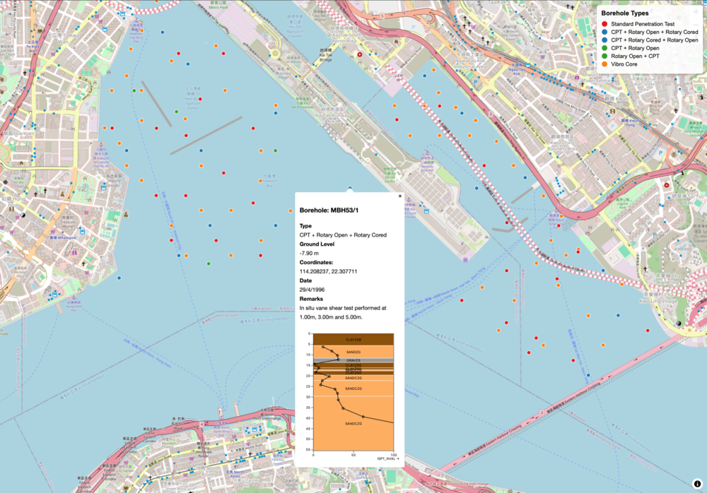

# Bedrock AGS to Web Map Demo

Transform geotechnical AGS files into interactive web maps that stakeholders can explore in any browser.



## Overview

This repository demonstrates how to convert AGS (Association of Geotechnical and Geoenvironmental Specialists) files into web-friendly formats and create an interactive map visualization. Instead of sharing folders of specialized files, you can provide stakeholders with a single web page showing investigation locations with detailed popups.

## What You'll Get

- **Interactive web map** displaying borehole locations
- **Clickable markers** showing investigation details
- **Geology columns** and **SPT charts** for technical stakeholders
- **No specialized software required** - works in any web browser

## Installation

```bash
uv sync
```

## Quick Start

### 1. Data Processing

Transform your AGS files using the interactive Python notebook:

```bash
cd data_processing
uv sync                         # Install dependencies
marimo edit ags_to_geojson.py   # Open interactive notebook
```

The notebook will:

- Load AGS files using `bedrock-ge`
- Convert to standardized geospatial format
- Export GeoJSON for web mapping
- Generate JSON files for in-situ test data

### 2. View the Web Map

Start a local server to view the interactive map:

```bash
cd webmap
python3 -m http.server 8000
```

Then visit http://localhost:8000.

## Requirements

**For data processing:**

- Python 3.13+
- Dependencies: `bedrock-ge`, `geopandas`, `marimo`

**For web visualization:**

- Any modern web browser
- Local web server (for loading data files)

## Data Requirements

You'll need:

- **AGS files** from your geotechnical project
- **Coordinate Reference System (CRS)** information
  - Horizontal CRS (e.g., EPSG:2326 for Hong Kong)
  - Vertical CRS (e.g., EPSG:5738 for Hong Kong)

## Features

### Interactive Map

- **Color-coded markers** by investigation type (SPT, CPT, etc.)
- **Popup details** with borehole information
- **Ground level elevations** and coordinates
- **Investigation dates** and remarks

### Technical Details (Optional)

- **Geology columns** showing soil layers
- **SPT charts** with N-values vs depth

## Sample Data

The repository includes sample AGS files from the Kai Tak development area in Hong Kong, demonstrating the workflow with real geotechnical data.

## Technologies Used

- **[bedrock-ge](https://github.com/bedrock-engineer/bedrock-ge)** - AGS file processing
- **[MapLibre GL JS](https://maplibre.org/)** - Web mapping
- **[Observable Plot](https://observablehq.com/plot/)** - Data visualization
- **[marimo](https://marimo.io/)** - Interactive reactive Python notebooks

